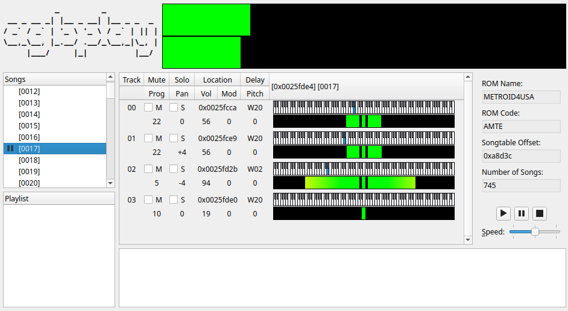

# agbplay-gui

**agbplay-gui** is a music player for Game Boy Advance ROMs that use the MusicPlayer2000
(mp2k/m4a/"Sappy") sound engine. It is based on [agbplay](https://github.com/ipatix/agbplay)
by ipatix.

## Building

agbplay-gui depends on the following libraries:

* Qt 5
* PortAudio

A build script is provided for compiling on Windows using MSYS2. This script will download
and build the required dependencies automatically. This script also supports cross
compiling agbplay-gui from a non-Windows system with MinGW.

First ensure that the agbplay submodule is checked out and up to date:

* `git submodule update --init --recursive`

To build on Windows using the automatic build script:

* `make -C windows`

To cross-compile a 32-bit binary using MinGW:

* `make -C windows CROSS=mingw32`

To cross-compile a 64-bit binary using MinGW:

* `make -C windows CROSS=mingw64`

To build using locally-installed libraries:

* `qmake`
* `make`

## License

**agbplay-gui** is created by Adam Higerd. It is derived from agbplay by
ipatix. Both agbplay and agbplay-gui are distributed under the terms of
the LGPLv3.

*This program is free software: you can redistribute it and/or modify it
under the terms of the GNU Lesser General Public License as published by the
Free Software Foundation, either version 3 of the License, or (at your
option) any later version.*

*This program is distributed in the hope that it will be useful, but
WITHOUT ANY WARRANTY; without even the implied warranty of MERCHANTABILITY
or FITNESS FOR A PARTICULAR PURPOSE. See the GNU Lesser General Public
License for more details.*

*For more information about the GNU Lesser General Public License, see
[https://www.gnu.org/licenses](https://www.gnu.org/licenses).*

agbplay source code: [https://github.com/ipatix/agbplay](https://github.com/ipatix/agbplay)
